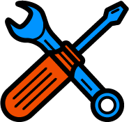
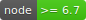
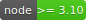

# Get started

## Installation & dependencies

### Requirements

First, you will need [](https://nodejs.org/en/) and [](https://www.npmjs.com/) installed in your system.

Then, if you want to use the **testing environment**, you will need [PhantomJS](http://phantomjs.org/) and [CasperJS](http://casperjs.org/) :

````bash
$ npm install -g phantomjs casperjs
````

And finally, to use the **generator**, you will have to install [Yeoman](http://yeoman.io/) globally :

````bash
$ npm install -g yo
````

## Installation

To install **Toolbox**, just run :

````bash
$ npm install -g generator-toolbox
````
